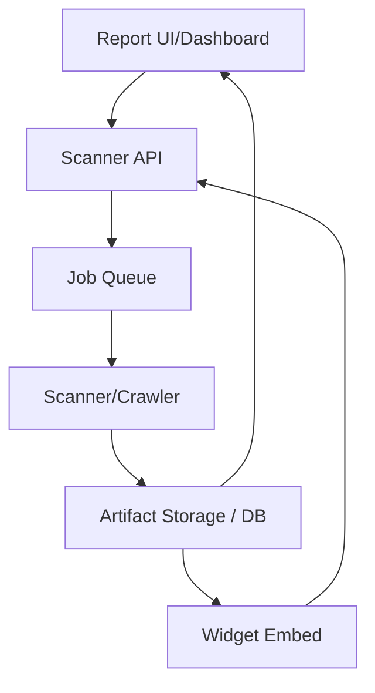

# Raawi X Remediation Baseline - Phase 0

## 1. Executive Summary
This document provides an audit-only baseline of the existing Raawi X accessibility platform. The audit verifies the repository structure, architectural dependencies, current state of implementation, and known risks. No source code has been modified.

## 2. Repository Architecture
**Apps (`apps/`)**
- `scanner`: Backend scanning engine.
- `report-ui`: Dashboard for managing entities/scans.
- `widget`: Client-side embed.
- `agent-runtime`: Experimental Agent module.

**Packages (`packages/`)**
- `core`: Shared DB types.
- `report`: Report models.
- `rules`: WCAG rules logic.
- `semantic-engine`: Partially implemented semantic mapping.

## 3. Application Architecture

## 4. Widget Authority (Verified)
The widget prioritizes DOM for reading structural content but relies on the API for guidance, translations, and semantic analysis.
- **Page Content/Interaction**: Authoritative source is the live DOM (via standard querySelectors in `apps/widget/src/widget.ts`).
- **Semantic / AI Guidance**: Fetches from `/api/widget/page-package`, `/api/widget/guidance`, `/api/semantic-page` (Third-Layer fetch).
- **Issues/Accessibility Results**: Fetches via `fetchIssuesAsync()` hitting `/api/widget/issues`. If the API fails or returns nothing, it falls back to a minimal client-side fallback or degrades gracefully without applying scan overlays.
- **assistive-map.json**: Not directly fetched by the widget. It uses API endpoints.
- **a11y.json**: ZERO consumption by the widget.

## 5. Artifact Consumer Trace
- **page.json / page.html / screenshot.png**:
  - **Created by**: `apps/scanner/src/crawler/page-capture.ts`
  - **Consumed by**: UI (for reports/screenshots), Rules Engine (JSDOM parsing on HTML).
- **vision-summary.json**:
  - Generated by vision analysis phase, stored as findings in DB.

## 6. a11y.json — Final Architectural Trace
- **Created by**: `apps/scanner/src/crawler/page-capture.ts` (using `page.evaluate` to get visible DOM nodes).
- **Persisted by**: `apps/scanner/src/db/scan-repository.ts` (Path saved to DB `Page` record).
- **Read by**: `apps/scanner/src/runner/report-generator.ts` (loads to `artifact.a11y`).
- **Consumed by**: **ZERO DOWNSTREAM CONSUMERS**. The rules engine uses `page.html`, and the widget uses API endpoints.
- **Potential Intended Consumer**: Mentioned in `SEMANTIC_ENGINE_IMPLEMENTATION_PLAN.md` as an optional input for the semantic builder.
- **Classification**: **C. Confirmed dead artifact** (in current practical use).

## 7. Semantic Engine Verification
Located in `packages/semantic-engine/`.
- **Produces**: Semantic structures (`schema.ts`).
- **Consumed by**: `apps/scanner/src/crawler/page-capture.ts` imports `buildSemanticModel`. Widget fetches via `/api/semantic-page`.
- **Status**: PARTIALLY IMPLEMENTED. Contains files like `confidence.ts`, `schema.ts`, `builder.ts`. It has linting errors (`prefer-const` violations in `confidence.ts`). It is experimental but actively plumbed into the capture flow.

## 8. Raawi Agent End-to-End Trace
The Raawi Agent aims to simulate interaction, but its current integration is primarily an experimental trace.
- **Agent Start**: `apps/scanner/src/agent/interaction-agent.ts`
- **Navigation**: Uses `playwright-action-bindings.ts` (PARTIAL).
- **Observation**: `apps/scanner/src/agent/page-understanding.ts`
- **Action Selection**: `apps/scanner/src/agent/planner.ts`
- **Result/Reasoning**: Uses LLM logic.
- **AgentFinding Generation**: Yields structured findings, which are pushed to the `AgentFinding` DB table.
- **Trace Persistence**: Saves traces to `agentPath` on `Page` records.
- **API Exposure**: `apps/scanner/src/api/scan-detail.ts` reads `agentFindings` and maps them to `layerAgent`.
- **Report UI**: `apps/report-ui/src/pages/ScanDetailPage.tsx` displays them in "Analysis AI agent".
- **Verdict**: PARTIAL. It does perform Playwright interactions, but it runs as a parallel, disjointed pipeline from the Classic audit.

## 9. Classic vs Agent Pipeline Trace
- **Classic**: `job-queue.ts` -> `bfs-crawler.ts` -> `page-capture.ts` -> `report-generator.ts` (WCAG rules run over HTML). Produces `Finding`.
- **Agent**: Experimental runtime in `apps/agent-runtime` and `apps/scanner/src/agent`. Produces `AgentFinding`.
- **Overlap**: They share the same `Scan` and `Page` structures in the DB, but their finding outputs are parallel tables.

## 10. DGA Implementation Matrix
| Feature | Classification | File | Status | Root Cause |
|---------|----------------|------|--------|------------|
| Platform Accessibility | UI/UX | `apps/report-ui/src/index.css` | PARTIAL | Basic contrast/focus but incomplete. |
| Scan Comparison | Functional/Core | `N/A` | MISSING | Not implemented in DB or UI. |
| Screenshots/Evidence | UI + Backend | `apps/scanner/src/crawler/page-capture.ts` | CONFIRMED | Captured via Playwright, served to UI. |
| Homepage/Logo | UI/UX | `apps/report-ui/src/pages/OverviewPage.tsx` | CONFIRMED | UI component exists. |
| WCAG rule names/desc | UI + Backend | `packages/rules/src/index.ts` | CONFIRMED | Mapped in rules definitions. |
| Quick Actions | UI/UX | `apps/report-ui/src/pages/ScanDetailPage.tsx` | PARTIAL | Some actions exist, others missing. |
| Entities search/sort | UI/UX | `apps/report-ui/src/pages/EntitiesPage.tsx` | CONFIRMED | Exists in React components. |
| Scan Name | UI + Backend | `apps/scanner/prisma/schema.prisma` | MISSING | DB lacks a specific scan name field. |
| Websites search/sort | UI/UX | `apps/report-ui/src/pages/SitesPage.tsx` | CONFIRMED | Basic implementation exists. |
| Multi-page crawling | Functional/Core | `apps/scanner/src/crawler/bfs-crawler.ts` | CONFIRMED | Handled by BFS crawler maxDepth. |
| Authentication | Functional/Core | `apps/scanner/prisma/schema.prisma` | CONFIRMED | `ScanAuthProfile` implemented. |
| Classic vs Agent | UI + Backend | `apps/report-ui/src/pages/ScanDetailPage.tsx` | CONFIRMED | Distinct UI tabs/sections present. |
| Duplicate PDF options | UI/UX | `apps/report-ui/src/pages/ScanDetailPage.tsx` | LIKELY | Multiple buttons exist in UI. |
| Arabic/English | UI + Backend | `apps/report-ui/src/i18n` | PARTIAL | Some UI translated, export strings mixed. |
| Excel localization | Functional/Core | `apps/scanner/src/api/excel-export.ts` | LIKELY | Export headers hardcoded or weakly localized. |
| Add Entity a11y | UI/UX | `apps/report-ui/src/pages/EntitiesPage.tsx` | LIKELY | Modal lacks proper focus trapping. |
| Direct Scan Nav | UI/UX | `apps/report-ui/src/pages/ScansPage.tsx` | CONFIRMED | Links to `/scan/:id`. |
| Severity-first | UI/UX | `apps/report-ui/src/pages/FindingsPage.tsx` | PARTIAL | Sorting logic exists but may not default to severity. |
| Trace failure | UI + Backend | `apps/scanner/src/agent/interaction-agent.ts` | UNKNOWN | Traces occasionally fail due to LLM parsing. |
| Applicable Not logic | UI + Backend | `apps/scanner/src/runner/report-generator.ts` | MISSING | Not natively tracked in findings struct. |

## 11. Test Baseline Closure
- **pnpm type-check**: FAILED (`apps/report-ui` fails with TS6310 on `packages/core`).
- **pnpm lint**: FAILED (`packages/semantic-engine/src/confidence.ts` has prefer-const errors).
- **pnpm test**: FAILED (Script not found at root, `vitest` command failed in `apps/scanner` due to environmental missing globals).
- **Safe Tests**: Could not run test suites meaningfully as they rely on local postgres/redis availability and globally installed vitest binaries.

---

# PHASE 0 CLOSURE VERDICT

## 1. CONFIRMED FACTS
- The system correctly generates and archives scan artifacts (`html`, `screenshot.png`), but `a11y.json` is a confirmed dead artifact that provides no functional value to downstream consumers.
- The `widget.ts` relies on API endpoints (`page-package`) for intelligence, not direct artifact loading.
- The Agent and Classic audits run as distinct, parallel pipelines producing disparate findings (`Finding` vs `AgentFinding`), causing UI fragmentation.
- DGA-relevant capabilities (PDF/Excel exports, Authentication, Multi-page crawling) are present but suffer from localization and schema limitations (e.g., missing Scan Name, missing Applicable Not state).

## 2. REMAINING UNKNOWN / UNVERIFIED ITEMS
- The exact success rate of the Agent's automated interaction (`playwright-action-bindings.ts`) in live environments.
- Whether `semantic-engine` can reliably replace legacy HTML JSDOM parsing once linting and architecture are fixed.

## 3. ITEMS READY FOR PHASE 1
- **Unifying Findings**: `AgentFinding` and `Finding` need to be unified in the schema/API layer to simplify the UI and exports.
- **DGA UI/UX Fixes**: Simple fixes to PDF/Excel localization, duplicate buttons, and sorting can begin immediately.
- **Artifact Cleanup**: `a11y.json` generation can be evaluated for removal or true integration into the semantic engine.
- **Widget Refactoring**: The `widget.ts` monolithic architecture is fully mapped and ready to be modularized.
